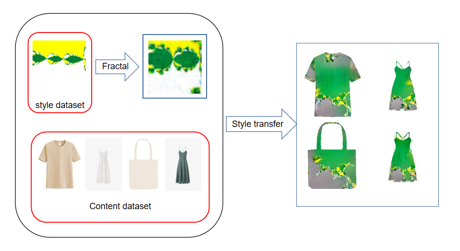

# Design Your Own Gucci: DL-Driven Fashion Image Generation



## How to run code
```commandline
git clone https://github.com/GeCao/DL-Driven-Fashion-Image-Generation.git
cd DL-Driven-Fashion-Image-Generation
pip install -r requirements.txt
pip install cv2
cd data
wget https://download.pytorch.org/models/vgg19-dcbb9e9d.pth
cd ..
python main.py --run_type both
```

You will finally find the transferred style cloth 
at ```data/transferred.png```, and your generated texture
with fractal neural network at ```fractal/results/pred_vali_*```

## How to retrain the network
### 1. retrain the Neural fractal network
In this part, you need to generate the dataset firstly.
```commandline
cd src/fractal
python newton_taichi.py
```
This script will automatically generate a dataset 
at ```data/fractal_dataset```, 
then please run the following code.

```commandline
cd ../..
python main.py --run_type fractal_generation
```

This command will generate some textures 
in ```data/fractal_results```, and a corresponding model
parameter at ```data/fractal_params.pth```

### 2. retrain the style transfer network

we always retrain this network since this is not an 
online process